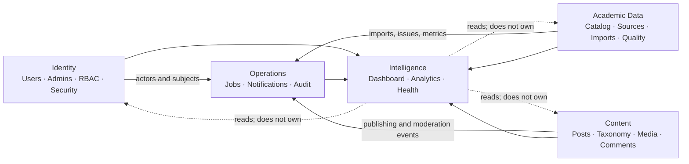
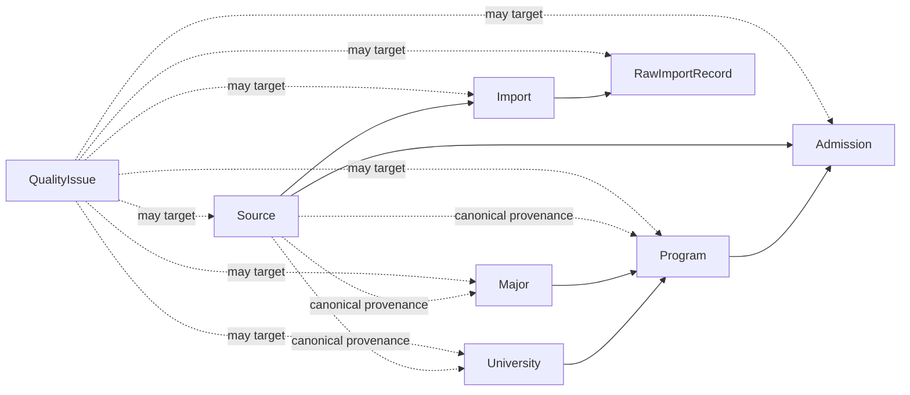
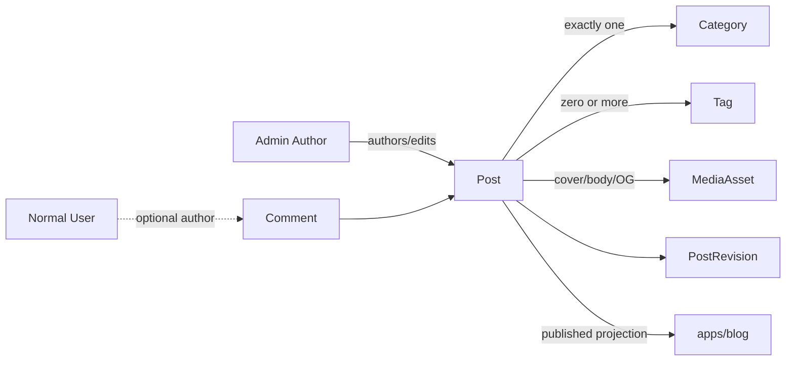
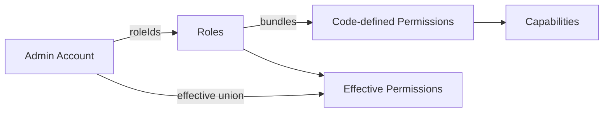
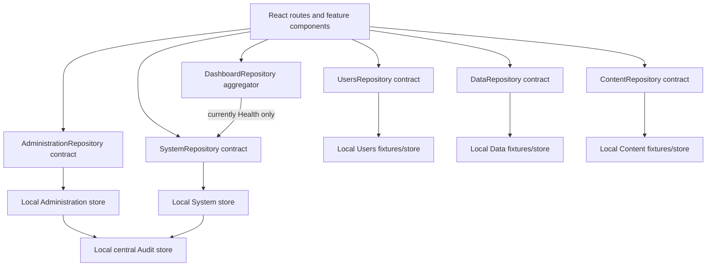
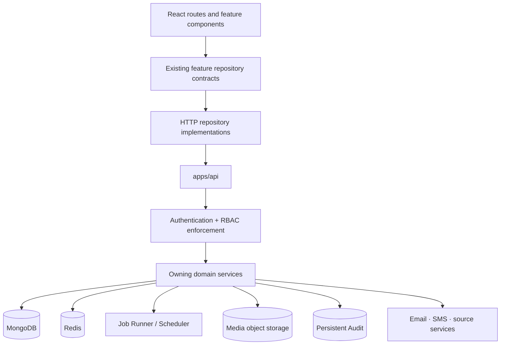

# Waand Admin Dashboard — Product, Domain & Architecture Specification

> Canonical reference for `apps/admin-dashboard`

## 1. Purpose, Scope, and Source-of-Truth Status

This document is the canonical product, domain, frontend-architecture, and future-backend reference for Waand Admin. It is written for developers, Codex, future AI agents, backend implementers, frontend implementers, reviewers, and maintainers who need to work on the Admin product without reconstructing its meaning from source files or previous conversations.

Waand Admin is Waand's internal operational control center. It is not a generic CRUD template. It coordinates identity operations, academic catalog ingestion and quality, editorial publishing, operational workflows, and platform intelligence while keeping each domain's ownership explicit.

Scope:

- Current implementation under `apps/admin-dashboard`.
- The public publishing contract observed under `apps/blog`.
- Sanjesh extraction terminology and source coverage observed under `tools/importers/sanjesh`.
- Canonical intended behavior defined here, including work not yet backed by `apps/api`.
- Future backend responsibilities and integration boundaries, without inventing API endpoints or database details.

Source-of-truth rules:

1. For product vocabulary, invariants, domain boundaries, permissions, routes, and intended workflows, this file is authoritative.
2. For what is executable today, the repository remains evidence. A statement labeled **Current implementation** describes inspected code as of this document's creation.
3. A statement labeled **Canonical intended behavior** is the contract future work must preserve or implement.
4. A **Migration/consistency note** names a known gap; it must not be read as already implemented.
5. Frontend route names do not imply backend endpoint names.

## 2. Executive Overview

Waand Admin contains five separate but interconnected conceptual subsystems:

| Subsystem | Scope | Why it is separate | Important connections |
|---|---|---|---|
| Identity | Normal Users, Admin Accounts, Roles, Permissions, Sessions, Security | User identity and privileged operator identity have different trust and lifecycle rules. | Users connect to academic profiles; Admins act through RBAC and generate Audit Events. |
| Academic Data | Universities, Majors, Programs, Admissions, Sources, Imports, Raw Records, Data Quality | Canonical catalog records must remain distinct from source provenance and ingestion attempts. | Users reference catalog entities; Imports create candidates and issues; Jobs execute ingestion. |
| Content | Blog overview, Posts, Categories, Tags, Media, Comments, SEO, Revisions | Editorial state and referential safety require workflows beyond generic record editing. | Admin authors own changes; `apps/blog` renders public output; scheduled publication creates Jobs. |
| Operations | Jobs, Notifications, Audit, review queues, operational tasks | Long-running or high-impact work requires explicit state, confirmation, and traceability. | Owning domains create Jobs and Audit Events; Dashboard summarizes actionable work. |
| Intelligence | Dashboard, Analytics, Data Quality, Monitoring, Service Health | Aggregation must not become a second owner of source data. | Reads selectors/services from Users, Data, Content, Administration, and System. |

These systems are separate so that authorization, mutation rules, and source-of-truth ownership stay clear. They are interconnected because an operator needs end-to-end context: a Comment may link to a User and Post; an Import may create Quality Issues against Programs; a Job may execute that Import; an Audit Event must link the acting Admin to the affected record; and Dashboard must present all of this without duplicating ownership.

### Admin subsystem overview



## 3. Technology Stack

The current Admin frontend is a client-rendered React application:

| Technology | Current use |
|---|---|
| React 19 | UI composition and state. |
| TypeScript 6 | Strict typed domain contracts and components. |
| Vite 8 | Development/build system; local host `127.0.0.1:3039`. |
| React Router DOM 7 | Browser routing through `<BrowserRouter>`, `<Routes>`, and `<Route>`. |
| Tailwind CSS v4 | Token-based styling through `@tailwindcss/vite`. |
| shadcn/ui 4 | Generated local primitives in `src/components/ui`. |
| Base UI | shadcn's Base UI-backed `base-lyra` configuration. |
| Lyra preset | `components.json` style is `base-lyra`, RTL enabled, neutral base color. |
| Phosphor Icons | Admin icon system; emoji icons are not part of the design language. |
| Tiptap 3 | Structured Post editor using StarterKit, Link, and a local media-image extension. |
| Framer Motion 13 | Page transitions and restrained UI motion, honoring user reduced-motion preference through `MotionConfig`. |
| Recharts 3 | Dashboard charts. |
| CVA, clsx, tailwind-merge | Primitive variants and class composition. |
| tw-animate-css | shadcn animation utilities. |
| Persian RTL + Peyda | `DirectionProvider direction="rtl"`; locally hosted regular and semibold Peyda WOFF2 fonts. |

Do not claim an uninstalled dependency. The public `apps/blog` application is a separate Next.js package and uses its own stack; its dependencies are not Admin dependencies.

## 4. Current Data Architecture and Integration Direction

### Current implementation

```text
React UI
    ↓
Feature service/repository contract
    ↓
Selected local in-memory repository
```

There is no mock mode and no production-UI/mock-UI switch. There is no `VITE_ADMIN_MOCK_MODE`. The local repository is the current normal frontend implementation. Browser refresh or module reload may reset its state because it is memory-backed.

Some filenames and exports still contain `mock`, such as `users/mocks/users-mock.ts`, `data/mock/data-mock-store.ts`, `mockUsersRepository`, `mockDataRepository`, and `mockDashboardRepository`. Those names describe fixture-backed implementation history; they do not represent a selectable runtime mode. Components must call repository contracts and must not import seed arrays directly.

Current repository selections:

| Contract | Selected implementation | Persistence |
|---|---|---|
| `UsersRepository` | `mockUsersRepository` | In-memory cloned fixtures |
| `AdminSessionRepository` | `localAdminSessionRepository` | In-memory fixed current identity |
| `DataRepository` | `mockDataRepository` | In-memory cloned fixtures |
| `ContentRepository` | `localContentRepository` | In-memory cloned fixtures |
| `AdministrationRepository` | `localAdministrationRepository` | In-memory cloned fixtures plus local central Audit store |
| `SystemRepository` | `localSystemRepository` | In-memory cloned fixtures plus central Audit writes |
| `DashboardRepository` | `mockDashboardRepository` | Mostly fixed snapshot; Service Health is read from System |

### Canonical intended behavior

```text
React UI
    ↓
same feature service/repository contracts
    ↓
HTTP repository implementations
    ↓
apps/api
    ↓
MongoDB / Redis / external services / workers / object storage
```

Backend integration should replace repository implementations, not rewrite page components, domain vocabulary, selectors, or validation UX. Browser-side permission checks remain presentation affordances only; `apps/api` must authenticate, authorize, validate, transact, persist, and audit every privileged mutation.

### Migration/consistency notes

- Users and Data still use `mock*` identifiers. Renaming may improve clarity later, but is not required for backend replacement and must not create a second abstraction layer.
- Administration and System write to the central local Audit store. Users, Data, and Content currently maintain separate fixture/local histories and do not consistently append central `AuditEvent` records.
- Dashboard currently owns hard-coded User, Content, Data Quality, activity, alert, and task snapshots. Only Service Health is read from its owning System repository. Canonically, all cards must read owning-domain selectors/services.
- `apps/blog` currently fetches a server contract whose Post `content` is an HTML string and renders only parsed `<h2>` and `<p>` text blocks. Admin currently authors Tiptap structured JSON. A deliberate server serialization/rendering contract is required before the two are considered integrated.
- The Admin Comments page explicitly states its local data is not connected to the public Blog.

## 5. Application Shell and Navigation

### Shell

`src/main.tsx` mounts React in strict mode, honors OS reduced-motion preferences, establishes RTL through `DirectionProvider`, and provides `BrowserRouter`. `src/App.tsx` is the current layout and route-composition boundary: it renders `SidebarProvider`, `AppSidebar`, `SidebarInset`, a 56-pixel header with trigger and page title, and an animated route content area.

The full interface is Persian-first and RTL. The Sidebar is independently configured with `side="right"`, `dir="rtl"`, and `collapsible="icon"`.

Desktop behavior:

- Sidebar is on the right.
- Expanded Sidebar shows labels and current Admin identity; icon-collapse hides branding text and labels through primitive state.
- Main content uses `min-w-0` and a bounded `max-w-[1600px]` on feature pages.
- Page changes use a short fade/horizontal motion; reduced-motion preference is honored globally.

Responsive behavior:

- The shadcn Sidebar primitive supplies mobile off-canvas/Sheet behavior while the trigger remains in the page header.
- Feature tables put horizontal scrolling on their table container.
- Detail and metric layouts collapse to fewer columns at smaller breakpoints.
- The document must never acquire page-level horizontal overflow.

Sidebar header branding is canonical:

```text
[logo] وآنــــــــــــــــــــــد
       داشبورد ادمین
```

The exact number of decorative elongation characters has varied in source. Preserve the product-visible form above when normalizing branding.

`خانه` (`/dashboard`) is a direct, non-collapsible item in its own `داشبورد` group. All other primary sections are collapsible groups.

### Complete navigation tree

```text
خانه

کاربران
├── همه کاربران
├── تعلیق‌شده‌ها
└── گزارش‌ها

داده‌ها
├── دانشگاه‌ها
├── برنامه‌های دانشگاهی
├── رشته‌ها
├── پذیرش‌ها
├── منابع
├── ورودی‌ها
└── کیفیت داده‌ها

محتوا
├── نوشته‌ها
├── دسته‌بندی‌ها
├── برچسب‌ها
├── رسانه
└── نظرات

مدیریت
├── ادمین‌ها
├── نقش‌ها
├── دسترسی‌ها
└── لاگ ممیزی

سیستم
├── سلامت سرویس
├── جاب‌ها
├── امنیت
├── فلگ‌های ویژگی
└── تنظیمات
```

## 6. Complete Route Map

Every route below is registered in `src/App.tsx`. The catch-all currently redirects to `/dashboard`.

| Route | Visible responsibility | Owning feature | Primary entities | Expected actions |
|---|---|---|---|---|
| `/dashboard` | Operational overview (`خانه`) | Dashboard/Intelligence | Cross-domain read models | Change period, refresh, follow links to owning domains. |
| `/users` | All normal Users (`همه کاربران`) | Users | `ManagedUser` | Search, filter, sort, paginate, open detail, suspend/ban/reactivate when permitted. |
| `/users/suspended` | Suspended User queue (`تعلیق‌شده‌ها`) | Users | `ManagedUser` | Review suspended accounts and reactivate with a reason. |
| `/users/reports` | User reports (`گزارش‌ها`) | Users | Future report entity | Current placeholder only; future list/triage without inventing a model now. |
| `/users/:userId` | User detail | Users | User, Profile, User Sessions, user-related Audit | View tabs, safe profile edit, verification reset, status change, session revocation, activity review. |
| `/data/universities` | University catalog | Data | University | Search/filter/sort/page, create/edit/archive, open detail, identify quality issues. |
| `/data/universities/:universityId` | University detail | Data | University, Programs, Sources, Quality Issues, history | Edit, inspect Programs/provenance/issues/history, initiate safe merge from issue workflow. |
| `/data/programs` | Concrete academic offerings | Data | Program, University, Major | Search/filter/sort/page, create/edit/archive, open detail. |
| `/data/programs/:programId` | Program detail | Data | Program, University, Major, Admissions, Sources | Edit, inspect references/admissions/provenance/issues/history. |
| `/data/majors` | Canonical disciplines | Data | Major | Search/filter/sort/page, create/edit/archive, open detail. |
| `/data/majors/:majorId` | Major detail | Data | Major, Programs, Universities, Sources | Edit and inspect cross-university offerings/provenance/issues/history. |
| `/data/admissions` | Admission/intake records | Data | Admission, Program, Source | Search/filter/sort/page, create/edit/archive, open detail. |
| `/data/admissions/:admissionId` | Admission detail | Data | Admission, Program, University, Major, Source | Edit and inspect context/history. |
| `/data/sources` | Provenance registry | Data | Source | Search/filter/sort/page, register/edit/archive Source, open detail. |
| `/data/sources/:sourceId` | Source impact and provenance detail | Data | Source, Imports, canonical entities | Edit Source; inspect affected Universities, Majors, Programs, Admissions, Imports, history. |
| `/data/imports` | Ingestion execution list (`ورودی‌ها`) | Data | Import | Filter/page and open a run. Imports are executions, not Sources. |
| `/data/imports/:importId` | Import pipeline detail | Data | Import, Source, RawImportRecord, QualityIssue | Advance allowed stages, review raw rows/issues/metrics, retry failure, confirm commit. |
| `/data/quality` | Data integrity work queue | Data | DataQualityIssue and target entity | Search/filter/page, inspect context, resolve using type-compatible action, ignore with reason, merge duplicates. |
| `/content` | Editorial operational overview | Content | ContentMetrics, Posts, Comments, history | Review queues, schedules, pending comments, recently edited Posts. |
| `/content/posts` | Post directory | Content | Post, Category, Tags, Admin author | Search/filter/sort/page, create, duplicate, open, transition when permitted. |
| `/content/posts/new` | Create Post | Content | New Post draft | Enter content/metadata, explicitly save Draft, then use permitted workflow actions. |
| `/content/posts/:postId` | Edit/preview Post | Content | Post, Media, SEO, Revisions | Edit, preview, save, review/publish/schedule/unpublish/archive/restore, restore a revision. |
| `/content/categories` | Category management | Content | Category, Post usage | Create/edit; delete only when unused. |
| `/content/tags` | Tag management | Content | Tag, Post usage | Create/edit; delete unused or detach after explicit confirmation. |
| `/content/media` | Image library | Content | MediaAsset, MediaUsage | Search/filter/view, upload supported image, edit alt/caption, inspect references, delete only when unused. |
| `/content/comments` | Comment moderation | Content | Comment, Post, optional User | Filter/page, approve, mark spam, trash, restore to approved, permanently delete only from trash. |
| `/administration/admins` | Admin account directory | Administration | AdminAccount, Roles | Search/filter/page, invite, open, suspend/reactivate/revoke invitation within safety rules. |
| `/administration/admins/:adminId` | Admin account detail | Administration | AdminAccount, Roles, effective Permissions | Edit identity/roles, inspect effective grants, status actions subject to self/SUPER_ADMIN protections. |
| `/administration/roles` | Role catalog | Administration | AdminRole | List, create custom role, duplicate, open, delete eligible unused custom role. |
| `/administration/roles/:roleId` | Role detail | Administration | AdminRole, Permissions, assigned Admins | Inspect/edit permitted roles and permission bundles; system-role rules apply. |
| `/administration/permissions` | Read-only permission catalog | Administration | Permission | Search/filter by group and inspect role usage. No ad-hoc key creation. |
| `/administration/audit` | Immutable audit explorer | Audit | AuditEvent, Admin actor, target | Search/filter/page, open safe before/after/metadata, follow target links. No edit/delete. |
| `/system/health` | Service status | System | ServiceHealth | Read current status, latency, uptime, message, last-check time. |
| `/system/jobs` | Background Job directory | System | BackgroundJob | Search/filter/page, open Job, retry/cancel only in allowed states. |
| `/system/jobs/:jobId` | Job detail | System | BackgroundJob, related owning entity | Inspect payload summary/error/timeline; retry/cancel with permission and confirmation. |
| `/system/security` | Privileged security operations | System/Security | AdminSession, LoginAttempt, SecurityEvent, BlockedIp | Inspect distinct tabs, revoke sessions, acknowledge/resolve events, block/unblock IPs. |
| `/system/feature-flags` | Runtime rollout controls | System | FeatureFlag | Read, create, edit, enable/disable; confirm changes affecting all users. |
| `/system/settings` | System configuration | System | SystemSettings sections | Read and explicitly save each section; confirm maintenance activation. |

## 7. Dashboard Specification

Dashboard is an operational overview, not a data owner. It should answer: what is changing, what is unhealthy, what needs an Admin decision, and where should the operator go next?

Primary information:

- Total Users, active Users, new Users, profile-completion rate, and User growth by period.
- Content counts: published, draft, in-review, and scheduled Posts; pending Comments.
- Latest Imports and their status/metrics.
- Open Data Quality issues by severity/type.
- Service Health and latency/uptime warnings.
- Alerts synthesized from owning systems.
- Recent Admin activity from Audit.
- Open operational tasks.
- Failed/running/queued Jobs.
- Open critical Security warnings.

Ownership examples:

```text
Service Health
→ System owns it
→ Dashboard reads it

Published Post count
→ Content owns it
→ Dashboard reads it

Open Quality Issue count
→ Data owns it
→ Dashboard reads it
```

**Current implementation:** `mockDashboardRepository` owns fixed User metrics, growth, Content counts, Quality summaries, activity, alerts, and tasks. It does call `systemRepository.getHealth()` and converts the System status model for the health card. Dashboard exposes `today`, `7d`, and `30d` growth periods and a manual refresh.

**Canonical intended behavior:** replace every hard-coded cross-domain array with selectors/service calls from Users, Data, Content, Administration/Audit, and System. Dashboard may compose and format results, but must not mutate or persist source-domain records.

## 8. Users Domain

### Boundary

**Normal User != Admin Account.** A normal User uses Waand's product; an Admin Account operates Waand's internal control plane. A User must never gain Admin authority because a browser field, route, or shared-looking identifier says so.

Canonical account states:

```ts
type UserAccountStatus =
  | 'ACTIVE'
  | 'PENDING'
  | 'SUSPENDED'
  | 'BANNED'
  | 'DELETED';
```

**Current implementation:** `UserStatus` uses lowercase values and calls pending state `pending_verification`: `active | pending_verification | suspended | banned | deleted`.

**Migration/consistency note:** transport/UI adapters may preserve current lowercase values temporarily, but domain discussions and future server contracts must make the mapping explicit rather than treating casing or `PENDING`/`pending_verification` as interchangeable by accident.

Expected capabilities:

- Listing, text search, status/verification/profile/date filters, sortable columns, pagination, detail navigation.
- Safe editing of non-sensitive profile fields.
- Suspend, ban, and reactivate with permission, explicit confirmation, and reason.
- Reset email or phone verification with reason; this does not reveal verification codes.
- List Sessions, revoke one or all permitted Sessions, and audit the action.
- Activity/Audit review and links to related academic data.
- Export when `users.export` is supported; current UI has no complete export flow.

**Current implementation details:** list search covers name, username, email, and phone. Filters include status, email verification, phone verification, completed profile, and registration date range. Sort fields include `createdAt`, `lastLoginAt`, `firstName`, `email`, and `status`. The Users list currently fixes `pageSize=25`, unlike the canonical 20/50/100 standard. User detail has overview, account/verification, Sessions, activity, and data tabs. The Sessions tab is presently a UI placeholder rather than a real per-User session collection.

Relationships:

```text
User → academic profile → University / Major / Program
User → Sessions
User → Audit Events
```

The current `ApplicantProfile` stores current/target field and university identifiers plus education, intake, language, budget, and scholarship preferences. These identifiers should resolve through the appropriate owning data source when integration is real; Users does not own University, Major, or Program definitions.

Sensitive values that must never appear in User models, list/detail responses, seed fixtures, logs, or UI:

- Passwords or password hashes.
- OTPs and verification codes.
- Access tokens, refresh tokens, and Session secrets.
- Authentication provider credentials.

## 9. Academic Data Domain and Relationship Model

Academic Data owns Waand's normalized educational catalog and all provenance/ingestion context needed to trust it.

| Concept | Precise Waand meaning | Example / non-example |
|---|---|---|
| University | Canonical educational institution. | `دانشگاه تهران` |
| Major | Canonical field/discipline independent of any University. | `مهندسی کامپیوتر` |
| Program | Concrete offering defined by University + Major + DegreeLevel. | `کارشناسی مهندسی کامپیوتر — دانشگاه تهران` |
| Admission | Academic intake/offering record for a Program in a particular year/source/context. | A Sanjesh رشته‌محل record; **not a User Application**. |
| Source | Provenance/origin artifact or authority. | A named Sanjesh PDF or official website. |
| Import | One ingestion execution against one Source. | A retryable processing run; **not the Source itself**. |
| RawImportRecord | Traceable source-shaped row before canonical commitment. | Extracted University/Major/code with match and validation state. |
| QualityIssue | Detected integrity, normalization, linkage, or provenance problem. | Duplicate University or unmapped Major. |

### Academic Data relationships



The current `QualityEntityType` union includes `UNIVERSITY | MAJOR | PROGRAM | ADMISSION | IMPORT | RAW_RECORD`; Source linkage is held separately by `sourceId`, and history additionally supports `SOURCE`. Canonically, a Quality Issue may target Source directly, so a future contract should add/normalize that entity type explicitly.

## 10. University Model and Workflow

```ts
interface University {
  id: string;
  nameFa: string;
  nameEn?: string;
  aliases: string[];
  countryCode: string;
  province?: string;
  city?: string;
  type: 'PUBLIC' | 'PRIVATE' | 'OTHER';
  website?: string;
  status: 'ACTIVE' | 'INACTIVE' | 'ARCHIVED';
  sourceIds: string[];
  createdAt: string;
  updatedAt: string;
}
```

List behavior includes search across Persian/English names and aliases; country, province, type, status, and quality-only filters; sorting and pagination; creation/editing; archive rather than unsafe hard delete. Detail shows core information, Programs, Sources/provenance, Quality Issues, and history.

Provenance is many-to-many through `sourceIds`. A University merge must union aliases and Source links, redirect dependent Programs, archive the duplicate, and preserve a trace. See §16.

## 11. Major Model and Workflow

```ts
interface Major {
  id: string;
  nameFa: string;
  nameEn?: string;
  aliases: string[];
  status: 'ACTIVE' | 'INACTIVE' | 'ARCHIVED';
  sourceIds: string[];
  createdAt: string;
  updatedAt: string;
}
```

Major exists independently of Universities. University-specific offerings belong to Program. The list supports name/alias search, status filter, sorting, pagination, create/edit/archive, and issue counts. Detail connects one Major to all Programs, Universities, Sources, issues, and history.

Never copy a Major record merely because another University offers it; create another Program referencing the same canonical Major.

## 12. Program Model and Workflow

```ts
type DegreeLevel =
  | 'ASSOCIATE'
  | 'BACHELOR'
  | 'MASTER'
  | 'PHD'
  | 'INTEGRATED'
  | 'OTHER'
  | 'UNKNOWN';

interface Program {
  id: string;
  universityId: string;
  majorId: string;
  degreeLevel: DegreeLevel;
  titleFa: string;
  status: 'ACTIVE' | 'INACTIVE' | 'ARCHIVED';
  sourceIds: string[];
  createdAt: string;
  updatedAt: string;
}
```

Program references must resolve to an existing University and Major. The current local repository rejects duplicate combinations of University + Major + DegreeLevel. `titleFa` is derived when absent using DegreeLevel, Major, and University; changing linked identity or degree must keep the display title consistent.

Detail combines the referenced University/Major, Admission counts, active Admission counts, Sources, Quality Issues, and history. Archiving a Program is a lifecycle change; it must not orphan Admissions.

## 13. Admission Model and Workflow

```ts
type ExamGroup =
  | 'MATH'
  | 'EXPERIMENTAL'
  | 'HUMANITIES'
  | 'ART'
  | 'LANGUAGE'
  | 'OTHER';

interface Admission {
  id: string;
  programId: string;
  sourceId: string;
  year: number;
  examGroup?: ExamGroup;
  admissionCode?: string;
  capacity?: number;
  admissionType?: string;
  status: 'ACTIVE' | 'INACTIVE' | 'ARCHIVED';
  notes?: string;
  createdAt: string;
  updatedAt: string;
}
```

Persian ExamGroup mappings:

| Code | UI label |
|---|---|
| `MATH` | `ریاضی` |
| `EXPERIMENTAL` | `تجربی` |
| `HUMANITIES` | `انسانی` |
| `ART` | `هنر` |
| `LANGUAGE` | `زبان` |
| `OTHER` | `سایر` |

Admission must resolve both `programId` and `sourceId`; `year` must be an integer. Admission is an academic offering/intake record. It is never a User's application, submission, acceptance, or candidacy.

## 14. Sources and Sanjesh Context

```ts
type SourceType = 'SANJESH_PDF' | 'OFFICIAL_WEBSITE' | 'MANUAL';
type SourceStatus = 'ACTIVE' | 'SUPERSEDED' | 'ARCHIVED';

interface Source {
  id: string;
  type: SourceType;
  title: string;
  year?: number;
  examGroup?: ExamGroup;
  filename?: string;
  sourceUrl?: string;
  status: SourceStatus;
  createdAt: string;
  updatedAt: string;
}
```

Source answers “where did this assertion originate?” A single Source can have multiple Import executions. **Source != Import.** Reprocessing the same PDF creates another Import against the same Source; it does not require another Source unless the artifact/version itself changed.

Canonical known Sanjesh Source filenames currently seeded in Admin:

```text
entekhabreste-ryazi-1404.pdf
entekhabreste-tajrobi-1404.pdf
entekhabreste-ensani-1404.pdf
```

**Current importer context:** `tools/importers/sanjesh/sources.py` also knows `entekhabreste-honar-1404.pdf` and `entekhabreste-zaban-1404.pdf`. These two are importer coverage, not yet canonical Admin Source fixtures. The extractor downloads PDFs, reconstructs Persian visual lines from word coordinates, normalizes Arabic/Persian characters, digits, bidi controls, half-spaces, and whitespace, detects University headings and five-digit رشته‌محل codes, deduplicates by `(year, examGroup, code)`, and emits raw JSON plus a University-oriented index.

The extractor is an initial offline ingestion tool, not application runtime. Its output must be validated before canonical import because Persian PDF layouts vary across year/group and text order is not reliably preserved.

## 15. Import Pipeline

Canonical lifecycle:

```text
ثبت منبع
↓
استخراج
↓
نرمال‌سازی
↓
اعتبارسنجی
↓
تشخیص تکراری
↓
بازبینی
↓
ثبت نهایی
```

Statuses:

```ts
type ImportStatus =
  | 'PENDING'
  | 'PARSING'
  | 'VALIDATING'
  | 'REVIEW_REQUIRED'
  | 'READY_TO_COMMIT'
  | 'COMMITTED'
  | 'FAILED';
```

Stage history is separately recorded as `REGISTERED`, `PARSED`, `NORMALIZED`, `VALIDATED`, `DEDUPLICATED`, `REVIEWED`, and `COMMITTED`. Metrics are `raw`, `parsed`, `valid`, `rejected`, `duplicates`, and `committed`.

Current action transitions:

| Current status | Action | Result |
|---|---|---|
| `PENDING` | `START` | `PARSING` |
| `PARSING` | `VALIDATE` | `VALIDATING`; marks parsed/normalized and calculates parsed count |
| `VALIDATING` | `PREPARE_COMMIT` | `REVIEW_REQUIRED` if rejected rows remain; otherwise `READY_TO_COMMIT` |
| `REVIEW_REQUIRED` | `PREPARE_COMMIT` | `READY_TO_COMMIT` after review path |
| `READY_TO_COMMIT` | `COMMIT` | `COMMITTED`; committed count becomes valid count; completion time recorded |
| `FAILED` | `RETRY` | `PENDING`; stages reset to registered and error/completion cleared |

Commit is high impact, explicitly confirmed, and one-way for the same Import. Future backend implementation needs a transaction boundary so canonical records, provenance, Import state, metrics, Quality Issues, and Audit either commit together or remain unchanged.

### RawImportRecord

```ts
interface RawImportRecord {
  id: string;
  importId: string;
  rowNumber: number;
  rawUniversityName: string;
  rawMajorName: string;
  rawAdmissionCode?: string;
  matchedUniversityId?: string;
  matchedMajorId?: string;
  validationState: 'VALID' | 'WARNING' | 'INVALID';
  errors: string[];
}
```

Raw imported data is evidence, not canonical data. Normalization may still map incorrectly; duplicate detection may be ambiguous; references may be missing; and one PDF row can be malformed. Raw records must remain traceable to Import and Source even after review.

## 16. Data Quality and Duplicate Merge

```ts
type DataQualityIssueType =
  | 'DUPLICATE_UNIVERSITY'
  | 'MISSING_UNIVERSITY_LOCATION'
  | 'UNMAPPED_MAJOR'
  | 'INVALID_ADMISSION_CODE'
  | 'UNKNOWN_DEGREE_LEVEL'
  | 'ORPHAN_PROGRAM'
  | 'MISSING_SOURCE';

type QualitySeverity = 'INFO' | 'WARNING' | 'CRITICAL';
type QualityStatus = 'OPEN' | 'RESOLVED' | 'IGNORED';
```

`DataQualityIssue` includes `id`, `type`, `severity`, `status`, `entityType`, optional `entityId`, `importId`, `rawRecordId`, `sourceId`, a title/description, `detectedAt`, and optional resolution timestamp/note.

Resolution philosophy:

- Resolution must address the cause, not merely hide the warning.
- The chosen action must be compatible with issue type.
- A non-empty decision note is mandatory.
- `IGNORED` means reviewed and consciously accepted; it is not equivalent to `RESOLVED`.
- Maintain Source, Import, Raw Record, and canonical entity links wherever applicable.
- Never discard raw evidence to make a metric look clean.

Current supported resolutions include University merge, map raw Major, set University location, set Admission code, set Program DegreeLevel, and ignore. `ORPHAN_PROGRAM` and `MISSING_SOURCE` are cataloged but do not yet have a dedicated local resolution action.

### Duplicate University merge

Before merge, the UI must present explicit roles:

```text
SOURCE = duplicate record that will be archived
TARGET = canonical record that will survive
```

Compare before confirmation:

| Field/impact | SOURCE | TARGET | Reviewer question |
|---|---|---|---|
| Names | Persian, English | Persian, English | Which is canonical? |
| Aliases | Existing aliases | Existing aliases | Which names must be retained? |
| Geography | Country/province/city | Country/province/city | Is location genuinely equivalent? |
| Type | Public/private/other | Public/private/other | Is institution type compatible? |
| Sources | Provenance IDs | Provenance IDs | Will every origin remain traceable? |
| Programs | Dependent offerings | Dependent offerings | Could redirect create duplicate Program tuples? |

Impact preview must include Programs, their Admissions, and provenance references.

Canonical post-merge result:

1. All SOURCE Program relations move safely to TARGET.
2. Dependent Admissions remain reachable through their Programs.
3. TARGET aliases include SOURCE primary/alias names without duplicates.
4. TARGET provenance unions both `sourceIds` sets.
5. SOURCE is archived, not silently erased.
6. The Quality Issue becomes resolved with note/timestamp.
7. A central `DATA_DUPLICATE_MERGED` Audit Event is created.
8. No dangling or duplicate-invalid reference is created.

**Current implementation:** redirects Program `universityId`, unions aliases and Source IDs, archives SOURCE, adds local Data history, and resolves the issue. It does not presently detect a Program uniqueness collision created by the redirect, and it does not append the central Audit Event.

**Migration/consistency note:** the future transactional merge must preflight Program collisions and define deterministic consolidation or reject the merge until conflicts are resolved.

## 17. Content / Blog Domain

Content is Waand's professional Blog CMS, comprising Overview, Posts, Categories, Tags, Media, Comments, SEO, and immutable Revisions.

Admin CMS owns editorial management and canonical editorial workflow. `apps/blog` owns public rendering, public metadata, sitemap behavior, search/category archives, and reader-facing error/loading/empty states.

### Content relationships



### Public Blog contract observed today

`apps/blog` is a Persian RTL Next.js App Router application with public routes:

| Public route | Responsibility |
|---|---|
| `/` | Featured/latest Posts and Category navigation. |
| `/posts/:slug` | Published Post detail, canonical/OG/Twitter metadata, BlogPosting JSON-LD, tags, related Posts. |
| `/category/:slug` | Category archive with canonical metadata and pagination. |
| `/search?q=...` | Non-indexed search results, minimum two-character query. |
| `/sitemap.xml` | Dynamic published Post and Category URLs; falls back to root on API failure. |
| `/robots.txt` | Public indexing policy. |

The Blog fetches server-only from `${BLOG_API_URL or NEXT_PUBLIC_API_URL}/blog`, without persistent fetch caching, and expects a public projection: Post summaries/detail, Category, author display information, SEO, pagination, and related Posts. Post URLs and Category URLs are slug-based. Missing Post/Category returns a reader-facing 404. Search pages are `noindex,follow`.

**Current mismatch:** Blog's `BlogPost.content` is HTML text and `parseArticleContent` currently extracts only `<h2>` and `<p>` into plain-text blocks. Admin stores an `EditorDocument` JSON tree and permits richer nodes/marks. Backend/public rendering must intentionally serialize or render the structured document safely; do not simply stringify JSON or trust arbitrary HTML.

## 18. Posts, Editor, Workflow, Validation, and Revisions

### Post model

```ts
interface Post {
  id: string;
  title: string;
  slug: string;
  excerpt: string;
  content: EditorDocument;
  coverMediaId?: string;
  categoryId: string;
  tagIds: string[];
  authorAdminId: string;
  status: 'DRAFT' | 'IN_REVIEW' | 'SCHEDULED' | 'PUBLISHED' | 'ARCHIVED';
  seo: PostSeo;
  scheduledAt?: string;
  publishedAt?: string;
  archivedAt?: string;
  createdAt: string;
  updatedAt: string;
  lastEditedByAdminId: string;
}
```

`PostSeo` currently contains optional title, description, canonical URL, OG Media ID, and `noIndex`.

### Structured editor rules

Tiptap is the current editor. The primary content source is structured JSON. Allowed content:

```text
Paragraph
H2
H3
Bold
Italic
Strike
Inline Code
Bullet List
Ordered List
Blockquote
Code Block
Horizontal Rule
Link
Image (MediaAsset reference)
Undo
Redo
```

H1 is forbidden inside article content. The Post title is the page H1. Tiptap StarterKit is configured to allow heading levels 2 and 3 only; the local `mediaImage` extension stores a Media ID rather than embedding uncontrolled files.

### Workflow transition table

| From | Action | To | Requirements/effects |
|---|---|---|---|
| `DRAFT` | Save | `DRAFT` | Incomplete Draft allowed; meaningful change creates a prior snapshot. |
| `DRAFT` | Submit review | `IN_REVIEW` | `content.posts.update`; current local transition does not enforce publish completeness. |
| `DRAFT` | Publish now | `PUBLISHED` | Publish permission and complete publish validation. |
| `DRAFT` | Schedule | `SCHEDULED` | Publish permission, complete publish validation, future timestamp. |
| `IN_REVIEW` | Return to Draft | `DRAFT` | Editorial correction path. |
| `IN_REVIEW` | Publish now | `PUBLISHED` | Publish permission and complete publish validation. |
| `IN_REVIEW` | Schedule | `SCHEDULED` | Publish permission and future timestamp. |
| `SCHEDULED` | Publish now | `PUBLISHED` | Clears schedule, records publication time. |
| `SCHEDULED` | Reschedule | `SCHEDULED` | New future timestamp. |
| `SCHEDULED` | Cancel schedule | `DRAFT` | Clears schedule/publication/archive timestamps. |
| `PUBLISHED` | Unpublish | `DRAFT` | Clears publication time; requires explicit action. |
| `PUBLISHED` | Archive | `ARCHIVED` | Records archive time. |
| `ARCHIVED` | Restore | `DRAFT` | Clears archive/publication/schedule timestamps. |

Current implementation maps `RETURN_TO_DRAFT`, `CANCEL_SCHEDULE`, and `RESTORE` to the shared Draft-reset branch. `ARCHIVE` is currently accepted only from `PUBLISHED`.

### Validation

| Field | Draft | Publishing/scheduling |
|---|---|---|
| Title | May be incomplete; maximum 120 | Required, 1–120 characters |
| Slug | May be incomplete; maximum 160; normalized and unique when set | Required, 1–160 characters, normalized, unique |
| Excerpt | May be incomplete; maximum 300 | Required, 1–300 characters |
| Content | Empty allowed | Meaningful text required |
| Category | Empty Draft tolerated | Exactly one valid Category required |
| Tags | Every supplied ID must resolve | Same; zero or more |
| Cover | Optional Draft | Valid MediaAsset required |
| SEO title | Optional, max 60 | Same |
| SEO description | Optional, max 160 | Same |
| Canonical URL | Optional valid URL | Same |
| Schedule | Optional | Future timestamp required for `SCHEDULE` |

Every referenced Category, Tag, cover image, editor image, and OG image must exist.

### Revisions

`PostRevision` is an immutable snapshot of title, slug, excerpt, content, cover, Category, Tags, and SEO plus revision ID, Post ID, created time, Admin ID, and optional summary.

- Create a revision on meaningful saves, not every keystroke.
- Current local update stores the **pre-edit** snapshot when the new snapshot differs.
- Restoring a revision first records the current Post as a new revision, then copies the selected snapshot into the current Post.
- Restore creates a new current state; it never mutates or deletes an old revision.
- Revisions remain immutable and traceable to the acting Admin.

## 19. Categories, Tags, Media, and Comments

### Categories and Tags

Every Post has exactly one Category for publication and zero or more Tags. Category deletion is blocked while any Post uses it. Tag deletion is blocked while used unless the operator explicitly confirms detachment from affected Posts.

```ts
interface Category {
  id: string;
  name: string;
  slug: string;
  description?: string;
  createdAt: string;
  updatedAt: string;
}

interface Tag {
  id: string;
  name: string;
  slug: string;
  createdAt: string;
  updatedAt: string;
}
```

Category and Tag names/slugs are unique in the current local repository.

- Category deletion is blocked while any Post uses it.
- Tag deletion is blocked while used unless the operator explicitly confirms detachment; confirmed deletion removes the Tag ID from every affected Post before deleting the Tag.
- Public Blog routes categories by Category slug. Changing a published Category slug therefore has public URL/SEO implications and should eventually support redirect policy.
- Tags are currently rendered as labels on `apps/blog`; there is no public Tag archive route in the inspected Blog.

### MediaAsset

```ts
interface MediaAsset {
  id: string;
  type: 'IMAGE';
  filename: string;
  mimeType: 'image/jpeg' | 'image/png' | 'image/webp' | 'image/avif';
  size: number;
  width: number;
  height: number;
  alt: string;
  caption?: string;
  url: string;
  createdAt: string;
  updatedAt: string;
  uploadedByAdminId: string;
}
```

Supported uploads are JPEG, PNG, WEBP, and AVIF. SVG is forbidden. The current simulated upload limit is 10 MB; the frontend reads browser object URLs and image dimensions, so this is not durable file storage.

Media referential safety:

- Usage is classified as `COVER`, `BODY`, or `OG`.
- Media used by any Post cover, editor content, or SEO OG image cannot be deleted.
- The UI must show all usages and require references to be removed or replaced first.
- Alt text and optional caption are editable; filename/MIME/dimensions/size are asset facts.
- Future storage must issue safe public URLs, validate actual file signatures server-side, and must not trust browser MIME declarations.

### Comments

```ts
interface Comment {
  id: string;
  postId: string;
  authorUserId?: string;
  guestName?: string;
  guestEmail?: string;
  body: string;
  status: 'PENDING' | 'APPROVED' | 'SPAM' | 'TRASHED';
  createdAt: string;
  updatedAt: string;
}
```

Moderation transitions:

| From | Allowed transitions |
|---|---|
| `PENDING` | `APPROVED`, `SPAM`, `TRASHED` |
| `APPROVED` | `SPAM`, `TRASHED` |
| `SPAM` | `APPROVED`, `TRASHED` |
| `TRASHED` | `APPROVED`, permanent delete after explicit confirmation |

Admins may moderate status but cannot rewrite Comment body. `authorUserId`, when present, links to the Users domain. Guest name/email are attribution metadata, not Admin identity. A Comment must always reference an existing Post. Current local moderation accepts any target status at repository level and relies on UI controls for the matrix; the future backend must enforce transitions independently.

## 20. Administration Domain and Current Admin

Administration owns privileged operator identity, role bundles, the code-defined Permission catalog, and Admin-facing account lifecycle. It does not own normal Users.

### Admin Account model

```ts
interface AdminAccount {
  id: string;
  displayName: string;
  email: string;
  avatarUrl?: string;
  status: 'ACTIVE' | 'INVITED' | 'SUSPENDED';
  roleIds: string[];
  mfaEnabled: boolean;
  lastLoginAt?: string;
  createdAt: string;
  updatedAt: string;
}
```

Credentials never belong in this model.

### Current local Admin identity

```text
id:          adm_001
displayName: خشایار مافی
email:       owner@waand.com
role:        SUPER_ADMIN
```

This is the current local frontend Admin identity until real Admin authentication integration exists. There is no special mock-auth mode. The current `AdminSessionRepository` exposes the same person as `firstName=خشایار`, `lastName=مافی`, username `owner`, role `admin`, `adminRoles=['SUPER_ADMIN']`, and all canonical permissions.

**Current implementation note:** an unregistered, minimal `src/features/authentication/admin-login.tsx` form exists in the working tree, but no route in `App.tsx` renders it and it performs no authentication. It is not evidence of an implemented Admin auth flow.

**Canonical intended behavior:** `apps/api` must own real Admin credential verification, MFA, Sessions, account status enforcement, and authorization. The Admin frontend owns only the UX and API orchestration.

## 21. RBAC Model, Permission Catalog, and Roles

### Relationship



Permission is the capability source. Roles are named bundles. An Admin's effective permissions are the union of all referenced Role grants. `SUPER_ADMIN` grants `*`, which expands to all code-defined keys.

Permissions are code-defined and read-only in UI. The `/administration/permissions` page may search, group, describe, and show role usage; it must not create, rename, or delete Permission keys. Adding/removing a key is a coordinated code/API change.

### Canonical Permission catalog

| Group | Keys |
|---|---|
| Dashboard | `dashboard.read` |
| Users | `users.read`, `users.update`, `users.suspend`, `users.ban`, `users.delete`, `users.verification.reset`, `users.sessions.revoke`, `users.export` |
| Data | `data.read`, `data.universities.manage`, `data.majors.manage`, `data.programs.manage`, `data.admissions.manage`, `data.sources.manage`, `data.imports.manage`, `data.imports.commit`, `data.quality.resolve`, `data.duplicates.merge` |
| Content | `content.read`, `content.posts.create`, `content.posts.update`, `content.posts.publish`, `content.posts.archive`, `content.categories.manage`, `content.tags.manage`, `content.media.manage`, `content.comments.moderate` |
| Analytics | `analytics.read` |
| Notifications | `notifications.read`, `notifications.create` |
| Administration | `administration.admins.read`, `administration.admins.create`, `administration.admins.update`, `administration.admins.suspend`, `administration.roles.read`, `administration.roles.manage`, `administration.permissions.read` |
| Audit | `audit.read` |
| System | `system.health.read`, `system.jobs.read`, `system.jobs.retry`, `system.jobs.cancel`, `system.security.read`, `system.security.manage`, `system.feature_flags.read`, `system.feature_flags.manage`, `system.settings.read`, `system.settings.manage` |

### System Role matrix

| Role | Exact behavior |
|---|---|
| `SUPER_ADMIN` | `*`; every code-defined Permission. Full grant is immutable. |
| `PLATFORM_ADMIN` | Every canonical Permission except `administration.roles.manage`; separately prohibited from modifying or assigning SUPER_ADMIN. |
| `SUPPORT` | `dashboard.read`, `users.read`, `users.update`, `users.suspend`, `users.verification.reset`, `users.sessions.revoke`. |
| `DATA_MANAGER` | `dashboard.read` and all canonical Data permissions, including Import commit, Quality resolution, and duplicate merge. |
| `CONTENT_MANAGER` | `dashboard.read`, every Content permission, and `analytics.read`. |
| `BLOG_EDITOR` | `dashboard.read`, `content.read`, `content.posts.create`, `content.posts.update`, `content.media.manage`; cannot publish/archive. |
| `BLOG_PUBLISHER` | `dashboard.read`, `content.read`, `content.posts.update`, `content.posts.publish`, `content.posts.archive`; cannot create or manage taxonomy/media/comments by default. |
| `ANALYST` | `dashboard.read`, `analytics.read`, `data.read`, `content.read`. |
| `AUDITOR` | `dashboard.read`; Admin/Role/Permission read; `audit.read`; read-only Health, Jobs, Security, Feature Flags, and Settings. |

System roles are seeded as `isSystem=true`. Current local code allows non-SUPER system roles to be edited but blocks deletion of every system role; `SUPER_ADMIN` permissions are also immutable. Custom role keys must begin `CUSTOM_` and use uppercase letters/numbers/underscores.

## 22. Admin Safety Rules

These protections are mandatory in both UI affordances and server enforcement:

- An Admin cannot suspend their own account.
- An Admin cannot remove their own last SUPER_ADMIN ability.
- The last ACTIVE SUPER_ADMIN cannot be suspended.
- The last ACTIVE SUPER_ADMIN cannot lose SUPER_ADMIN.
- A PLATFORM_ADMIN cannot modify a SUPER_ADMIN account or assign SUPER_ADMIN.
- An active Admin is never hard-deleted; suspension is the reversible lifecycle action.
- An INVITED Admin may have the invitation revoked; this is distinct from deleting an active account.
- Every `roleId` must resolve before save.
- A Role assigned to any Admin cannot be deleted.
- System Roles cannot be deleted; SUPER_ADMIN grants cannot be edited.

Current local repository enforces these checks for Administration mutations and also authorizes the acting Admin by effective Permission. The backend must re-enforce them transactionally; client state is never authoritative.

## 23. Audit Domain

Audit is immutable, append-only, cross-cutting, and central. It records who or what performed an operationally meaningful action, the target, safe before/after context, result, and correlation information.

```ts
interface AuditEvent {
  id: string;
  occurredAt: string;
  actorAdminId?: string;
  action: string;
  domain: string;
  targetType?: string;
  targetId?: string;
  targetLabel?: string;
  summaryFa: string;
  result: 'SUCCESS' | 'FAILURE';
  source: 'ADMIN_UI' | 'SYSTEM';
  correlationId?: string;
  metadata?: Record<string, unknown>;
  before?: Record<string, unknown>;
  after?: Record<string, unknown>;
}
```

Rules:

- Append only: no edit and no delete.
- Store only safe operational metadata. Redact fields matching password, token, secret, credential, OTP, or verification-code concepts recursively.
- Before/after snapshots must be minimal and relevant, not complete secret-bearing objects.
- `actorAdminId` is optional for system actions; absence means System, not an anonymous Admin.
- Correlation IDs connect UI requests, server work, Jobs, Imports, and related Audit Events.
- Target links should resolve while targets exist; archived targets remain preferable to erased targets.
- Failed privileged operations should also be auditable when meaningful, with `result=FAILURE` and safe error classification.

Important Audit action families:

| Domain | Examples |
|---|---|
| Users | `USER_UPDATED`, `USER_SUSPENDED`, `USER_REACTIVATED`, `USER_BANNED`, verification reset, Session revocation, export requested/completed. |
| Admins | `ADMIN_INVITED`, `ADMIN_INVITATION_REVOKED`, `ADMIN_ROLES_CHANGED`, `ADMIN_SUSPENDED`, `ADMIN_REACTIVATED`. |
| Roles | `ROLE_CREATED`, `ROLE_UPDATED`, `ROLE_DELETED`. |
| Data | `DATA_ENTITY_UPDATED`, `DATA_DUPLICATE_MERGED`. |
| Imports | `IMPORT_STARTED`, `IMPORT_COMMITTED`, retry/failure/cancellation with Import/Job correlation. |
| Quality | `QUALITY_ISSUE_RESOLVED`, ignored decision, resolution reversal if ever supported. |
| Content | `POST_CREATED`, `POST_UPDATED`, `POST_PUBLISHED`, `POST_ARCHIVED`, revision restored. |
| Comments | `COMMENT_MODERATED`, permanent deletion. |
| Jobs | `JOB_RETRIED`, `JOB_CANCELLED`. |
| Security | event acknowledged/resolved, Session revoked, IP blocked/unblocked, MFA/security-setting changes. |
| Feature Flags | `FEATURE_FLAG_CREATED`, `FEATURE_FLAG_UPDATED`. |
| Settings | `SYSTEM_SETTINGS_UPDATED`, `MAINTENANCE_MODE_CHANGED`. |

**Current implementation:** one local Audit store is shared by Administration and System. User mutations maintain `UserAuditEntry` fixtures, Data maintains `DataHistoryEvent`, and Content maintains `ContentHistoryEvent`/Revisions. Canonically, these domain histories may remain useful read models, but meaningful mutations must also emit central Audit Events.

## 24. System Domain and Service Health

System owns Health, Jobs, Security, Feature Flags, and Settings. It exposes read models to Dashboard but remains the source of operational truth.

### Service Health

```ts
type ServiceStatus = 'HEALTHY' | 'DEGRADED' | 'DOWN' | 'UNKNOWN';

interface ServiceHealth {
  id: string;
  name: string;
  status: ServiceStatus;
  latencyMs?: number;
  uptimePercent?: number;
  message?: string;
  lastCheckedAt: string;
}
```

Canonical services are API, MongoDB, Redis, Email, SMS, Blog, and Job Runner. Current values are seeded local observations, not production telemetry. `/system/health` and Dashboard must consume the same System-owned dataset; Dashboard may reformat status but must not create its own health truth.

Status semantics:

- `HEALTHY`: operating within expected bounds.
- `DEGRADED`: available but impaired or outside target.
- `DOWN`: unavailable.
- `UNKNOWN`: not checked or evidence unavailable; never present as healthy by default.

## 25. Jobs

```ts
type JobStatus = 'QUEUED' | 'RUNNING' | 'SUCCEEDED' | 'FAILED' | 'CANCELLED';
type JobType =
  | 'SANJESH_IMPORT'
  | 'DATA_QUALITY_SCAN'
  | 'CONTENT_SCHEDULE_PUBLISH'
  | 'USER_EXPORT'
  | 'NOTIFICATION_BROADCAST';
```

`BackgroundJob` contains ID, type, title, status, optional progress, `attempts`, `maxAttempts`, lifecycle timestamps, optional triggering Admin, optional related entity/link, safe payload summary, and optional safe error message.

Action matrix:

| Status | Retry | Cancel | Read |
|---|---|---|---|
| `QUEUED` | No | Yes | Yes |
| `RUNNING` | No | Yes when the owning worker supports safe cancellation | Yes |
| `SUCCEEDED` | No | No | Yes |
| `FAILED` | Yes when `attempts < maxAttempts` | No | Yes |
| `CANCELLED` | No by default | No | Yes |

Current local retry changes FAILED → RUNNING → SUCCEEDED synchronously after incrementing attempts; real execution must be asynchronous and may fail again. `maxAttempts` is a hard retry ceiling, not an informational label.

Jobs are created by owning features—Data creates Import/Quality Jobs, Content creates scheduled-publish Jobs, Users creates export Jobs, Notifications creates broadcast Jobs. The System page observes and controls them; it does not offer arbitrary manual Job construction.

## 26. Security Domain

Four concepts must remain separate:

### AdminSession

```ts
interface AdminSession {
  id: string;
  adminId: string;
  status: 'ACTIVE' | 'REVOKED' | 'EXPIRED';
  createdAt: string;
  lastActiveAt: string;
  expiresAt: string;
  browser: string;
  os: string;
  deviceType: 'DESKTOP' | 'MOBILE' | 'TABLET';
  ipAddress: string;
  isCurrent: boolean;
}
```

It is a server-side Session record/summary. Never expose token values. Revoking the current Session requires separate confirmation; bulk revocation excludes current Session unless explicitly authorized.

### LoginAttempt

An immutable authentication observation with ID, email/identifier, success boolean, reason, IP, browser, and timestamp. Reasons:

```text
SUCCESS
INVALID_CREDENTIALS
MFA_FAILED
ACCOUNT_SUSPENDED
RATE_LIMITED
```

LoginAttempt is not a Session and not automatically a SecurityEvent; detection policy may correlate attempts into an event.

### SecurityEvent

Types:

```text
NEW_ADMIN_DEVICE
REPEATED_FAILED_LOGIN
MFA_DISABLED
SUSPICIOUS_LOGIN
IP_BLOCKED
SESSION_REVOKED
```

Severity is `INFO | WARNING | CRITICAL`; status is `OPEN | ACKNOWLEDGED | RESOLVED`.

Allowed state transitions:

- `OPEN → ACKNOWLEDGED` records that an operator has taken ownership.
- `OPEN → RESOLVED` is allowed for immediately completed handling.
- `ACKNOWLEDGED → RESOLVED` completes handling.
- `RESOLVED` is terminal in the current model.

The current repository enforces acknowledge only from OPEN and resolve from any non-RESOLVED state.

### BlockedIp

A control record with ID, IPv4 address, reason, `ACTIVE | EXPIRED` status, creation time, optional expiration, and creating Admin. It is not a SecurityEvent or LoginAttempt. Blocking requires valid IPv4, a reason, no existing active duplicate, and separate confirmation when the IP matches the current Session. Unblock changes status to `EXPIRED` and audits the action.

## 27. Feature Flags

```ts
interface FeatureFlag {
  id: string;
  key: string;
  nameFa: string;
  descriptionFa: string;
  enabled: boolean;
  rollout: {
    strategy: 'ALL' | 'PERCENTAGE' | 'ADMINS_ONLY';
    percentage?: number;
  };
  owner: 'PRODUCT' | 'DATA' | 'CONTENT' | 'PLATFORM';
  createdAt: string;
  updatedAt: string;
  updatedByAdminId: string;
}
```

Known flags:

```text
career_recommendation_v2
new_onboarding
ai_assistant
new_search_engine
```

Keys use lowercase `snake_case`, are unique, and become immutable after creation. Percentage is required only for `PERCENTAGE` and must be 0–100. Creating/enabling/changing a flag that affects all users requires explicit high-impact confirmation. All mutations require manage Permission and Audit.

Feature ownership identifies the responsible team/domain; it does not grant RBAC permissions by itself.

## 28. System Settings

Settings are grouped, explicitly saved, permission-protected, validated, audited, and never used to carry provider secrets or API keys.

| Section | Current fields | Validation/contract |
|---|---|---|
| `GENERAL` | `productName`, `defaultLocale`, `timezone`, `supportEmail` | Product name required; support email valid. Current types fix locale `fa-IR` and timezone `Asia/Tehran`. |
| `AUTHENTICATION` | `adminMfaRequired`, `adminSessionHours`, `userSessionDays`, `maxLoginAttempts`, `lockoutMinutes` | Admin Session 1–168 hours; User Session 1–90 days; attempts 3–20; lockout 1–1440 minutes. |
| `EMAIL` | `enabled`, `senderName`, `senderEmail`, `replyToEmail` | Sender name required; both email fields valid. No SMTP/provider secret fields. |
| `SMS` | `enabled`, `otpEnabled`, `notificationSmsEnabled` | Boolean capability switches only. No provider credentials. |
| `SEO` | `siteName`, `defaultTitle`, `defaultDescription`, `allowIndexing` | Default title ≤60; description ≤160. |
| `BLOG` | `postsPerPage`, `commentsEnabled`, `guestCommentsEnabled`, `commentsRequireModeration` | Posts per page 6–50. Guest/comment combinations should be validated coherently server-side. |
| `MAINTENANCE` | `enabled`, `message`, `allowAdminAccess` | Non-empty message when enabled; enabling from disabled requires explicit confirmation. |

Current seeded values include product `Waand`, Persian locale, Tehran timezone, required Admin MFA, 12-hour Admin Sessions, 30-day User Sessions, 5 login attempts, 15-minute lockout, Blog page size 12, comments enabled, guest comments disabled, moderation required, and maintenance disabled.

Do not autosave System settings. Operators must see dirty state, submit explicitly, receive validation feedback, and confirm high-risk changes.

## 29. Cross-Feature Ownership and Relationships

### Ownership matrix

| Concept | Owning subsystem | Read by | Must NOT be owned by |
|---|---|---|---|
| Normal User Account | Users/Identity | Dashboard, Comments, Audit | Administration, Content, Dashboard |
| Admin Identity | Administration/Identity | all privileged features, Audit, Security | Users, Dashboard |
| Role | Administration | Admin management, authorization | Users, feature pages |
| Permission | Administration/code contract | Roles, guards, backend authorization | editable UI data, Dashboard |
| University | Academic Data | Programs, User academic profile, Dashboard | Users, Imports, Dashboard |
| Major | Academic Data | Programs, User academic profile | Universities, Users |
| Program | Academic Data | Admissions, User academic profile | University or Major modules independently |
| Admission | Academic Data | Data views, recommendation consumers | User Applications, Import |
| Source | Academic Data | Imports, canonical provenance, Quality | Import execution |
| Import/Raw Record | Academic Data operations | Quality, Jobs, Dashboard, Audit | Source, canonical catalog records |
| Quality Issue | Academic Data | Dashboard, Jobs, Audit | Dashboard |
| Post/Category/Tag/Media/Comment/Revision | Content | Blog, Dashboard, Audit; Users for Comment link | Blog rendering app, Dashboard |
| Audit Event | Audit | Administration, feature details | feature-specific editable history |
| Job | Operations/System, created by owning feature | Dashboard, System, Audit | Dashboard or manual System form |
| Service Health | System | Dashboard | Dashboard |
| Security records | System/Security | Dashboard, Audit, Administration | Users or generic Audit records |
| Feature Flag/System Settings | System | product/runtime consumers, Dashboard/Audit | individual feature UI |
| Dashboard Metric | Owning source subsystem; Dashboard composes | Dashboard | Dashboard persistence |

### Cross-feature relationship examples

```text
User → University / Major / Program through academic profile
Program → University + Major
Admission → Program + Source
QualityIssue → target entity + optional Import + RawImportRecord + Source
Post → exactly one Category + Tags + Media + Admin author
Comment → Post + optional Normal User
AuditEvent → optional actor Admin + optional target entity
Job → owning entity or workflow
SecurityEvent → optional Admin and/or IP
```

Cross-feature imports should flow through public feature entry points, service contracts, or shared neutral types—not by importing another feature's seeds or mutable state.

## 30. Repository Architecture

### Conceptual repositories

| Repository | Ownership | Current local implementation | Main consumers | Future replacement |
|---|---|---|---|---|
| `usersRepository` | Normal User lifecycle/profile/activity | `mockUsersRepository` | User list/detail/tabs; Dashboard selectors later | HTTP Users repository |
| `dataRepository` | Academic catalog, provenance, Imports, Quality | `mockDataRepository` | All `/data/**` pages; Dashboard selectors later | HTTP Academic Data repository |
| `contentRepository` | CMS editorial domain | `localContentRepository` | `/content/**`; Dashboard selectors later | HTTP Content repository backed by CMS services |
| `administrationRepository` | Admin Accounts, Roles, Permissions, Audit reads | `localAdministrationRepository` | `/administration/**`, System authorization lookup | HTTP Administration repository |
| `systemRepository` | Health, Jobs, Security, Flags, Settings | `localSystemRepository` | `/system/**`, Dashboard Health | HTTP System repository |

Dashboard currently has an additional `dashboardRepository`. Canonically it is an aggregation façade only; its implementation must call owning subsystem selectors/services.

### Current repository architecture



### Future repository/API architecture



Repository methods return cloned values today to prevent accidental UI mutation of the in-memory store. Future HTTP implementations should preserve equivalent typed results, abort support for reads, normalized validation errors, and authorization-aware failures.

## 31. Frontend Directory Architecture

### Current implementation

The inspected source organization is:

```text
apps/admin-dashboard/
├── public/
│   ├── fonts/
│   ├── favicon.ico
│   └── icons.svg
├── src/
│   ├── assets/
│   ├── components/
│   │   ├── app-sidebar.tsx
│   │   ├── nav-dash.tsx
│   │   ├── nav-main.tsx
│   │   ├── nav-user.tsx
│   │   └── ui/
│   ├── features/
│   │   ├── administration/
│   │   │   ├── admins/ audit/ data/ permissions/ repository/ roles/ shared/ types/
│   │   ├── authentication/
│   │   ├── content/
│   │   │   ├── categories/ comments/ data/ media/ overview/ posts/ repository/ shared/ tags/
│   │   ├── dashboard/
│   │   │   ├── components/ hooks/ mocks/ services/ types/
│   │   ├── data/
│   │   │   ├── admissions/ hooks/ imports/ majors/ mock/ programs/ quality/ services/ shared/ sources/ types/ universities/
│   │   ├── system/
│   │   │   ├── data/ feature-flags/ health/ jobs/ repository/ security/ settings/ types/
│   │   └── users/
│   │       ├── components/ hooks/ mocks/ pages/ services/ types/
│   ├── hooks/
│   ├── lib/
│   ├── styles/
│   ├── App.tsx
│   └── main.tsx
├── components.json
├── eslint.config.js
├── package.json
├── tsconfig*.json
└── vite.config.ts
```

`src/components/ui/` is for shadcn/Base UI primitives only. Shell/navigation components live one level above it. Domain behavior belongs under its owning `src/features/<domain>` tree.

### Recommended ownership

```text
src/features/
  dashboard/       # composition/aggregation only
  users/           # normal Users
  data/            # academic catalog, provenance, ingestion, quality
  content/         # CMS/editorial
  administration/  # Admins, Roles, Permissions, Audit UI
  system/          # Health, Jobs, Security, Flags, Settings
```

The existing layout already largely follows this ownership. Recommended consistency work is evolutionary: avoid moving working code merely to satisfy folder aesthetics. Authentication must ultimately become a real Admin identity feature tied to `apps/api`, not a standalone inert form.

## 32. Design System, RTL, Responsive, Tables, and Forms

### Design language

- Persian-first, complete RTL interface.
- Peyda typography in Admin.
- Tailwind CSS v4 tokens.
- shadcn Base UI using Lyra preset and neutral palette.
- Phosphor iconography.
- Information-dense operational layouts.
- Subtle borders, restrained radii, restrained shadows, clear status color semantics.
- Motion is functional, short, and reduced-motion aware.

Forbidden patterns:

- Random gradients.
- Glassmorphism.
- Neon styling.
- Emoji as interface icons.
- Decorative SaaS illustrations unrelated to an operational task.
- Inconsistent one-off primitives when a shared UI primitive exists.

**Current consistency note:** the global radius token is `0rem` and Data/Content/System lean square, while several Dashboard/Users surfaces still use `rounded-xl`. “Restrained radius” allows small purposeful rounding, but a future visual pass should select one coherent scale rather than preserve accidental feature differences.

### RTL rules

- Document/interface direction is `dir="rtl"`; Persian content is the default.
- Sidebar position is separately `side="right"`. Direction and physical Sidebar side are not the same concern.
- Prefer logical spacing/alignment: `ms`, `me`, `ps`, `pe`, `start`, `end`, and `text-start`.
- Apply explicit LTR only to values such as email, URL, code, Permission key, correlation ID, or filename.
- Portaled overlays must retain RTL direction.

### Responsive rules

| Viewport | Canonical behavior |
|---|---|
| Desktop | Dense operational UI, persistent/collapsible right Sidebar, multi-column summaries, full contextual columns. |
| Tablet | Reduce or move secondary information intelligently; preserve primary actions and entity identity. |
| Mobile | Single-column details, filters in Sheet/Drawer, compact actions, readable dialogs, no page-level horizontal overflow. |

Tables may scroll horizontally only inside the table container. Sticky/fixed UI must not hide form actions or keyboard focus. Mobile filters should not permanently consume content width.

### Table UX standard

Every mature list should support, where meaningful:

- Search.
- Domain-specific filters.
- Sort.
- Pagination and visible result count.
- Loading, empty, and error states with retry.
- Row navigation.
- Permission-aware action menu.
- URL query state so lists survive refresh/back navigation and can be shared.

Default page size is 20; allowed sizes are 20, 50, and 100. The current Users page's fixed 25 is a known inconsistency and should move to the standard when that feature is next touched.

### Form UX standard

- Keep typed form values and validate at both client UX and server trust boundaries.
- Display actionable Persian errors near fields plus a safe form-level error.
- Show submit/busy state and prevent duplicate submission.
- Track dirty state and warn before discarding meaningful edits.
- Use explicit Save; do not autosave important System/domain forms unless a workflow explicitly defines autosave.
- Require typed/high-context confirmation for dangerous operations as appropriate.
- Show clear success/error feedback and refetch affected read models.
- Never place secret/provider-credential fields into generic settings forms.

## 33. Destructive Operation Policy

| Operation | Risk | Confirmation required | Additional rules | Audit event |
|---|---|---|---|---|
| User suspend | Access interruption | Yes; show User identity and require reason | Permission; cannot imply deletion; revoke/retain Sessions by explicit policy | `USER_SUSPENDED` |
| User ban | Strong/indefinite access restriction | Yes; stronger copy and reason | `users.ban`; server-enforced; define Session effect | `USER_BANNED` |
| User delete | Data/privacy and referential loss | Yes; highest-friction confirmation | Prefer tombstone/anonymization; only with `users.delete`; never expose auth secrets | Dedicated User deletion event |
| Admin suspend | Privileged access interruption | Yes | Cannot self-suspend; PLATFORM_ADMIN/SUPER_ADMIN and last-active rules | `ADMIN_SUSPENDED` |
| Admin invite revoke | Removes pending access path | Yes | INVITED only; does not delete active Admin | `ADMIN_INVITATION_REVOKED` |
| Role delete | Authorization graph change | Yes | Custom, non-system, unassigned Role only | `ROLE_DELETED` |
| University merge | Large reference rewrite | Yes; explicit SOURCE/TARGET and impact preview | Transaction; preserve provenance; archive duplicate; resolve issue; no collisions/dangling refs | `DATA_DUPLICATE_MERGED` |
| Import commit | Canonical data mutation | Yes; show valid/duplicate/rejected counts | READY_TO_COMMIT only; idempotency/transaction; cannot recommit same run | `IMPORT_COMMITTED` |
| Media delete | Broken public content | Yes | Block while cover/body/OG usage exists | Media deletion event |
| Permanent Comment delete | Irreversible reader content loss | Yes; permanent wording | TRASHED only; moderation Permission | Comment deletion event |
| Job retry | Repeats side effects/work | Yes | FAILED only; attempts below max; owning Job idempotency | `JOB_RETRIED` |
| Job cancel | Partial-work risk | Yes | QUEUED or safely cancellable RUNNING only | `JOB_CANCELLED` |
| IP block | Operator/user lockout | Yes | Valid reason; duplicate check; extra confirmation for current IP | `IP_BLOCKED` |
| IP unblock | Removes security control | Yes | ACTIVE block only | `IP_UNBLOCKED` |
| Feature Flag high-impact change | Broad behavior change | Yes | Extra confirmation when active rollout is/will be ALL | `FEATURE_FLAG_UPDATED` |
| Maintenance enable | Product outage/read-only impact | Yes | Non-empty message; Admin access policy visible | `MAINTENANCE_MODE_CHANGED` |

Confirmation never replaces authorization, validation, transaction safety, idempotency, or Audit.

## 34. Referential Integrity and Sensitive Data Policy

### Referential integrity

- Program cannot reference a missing University or Major.
- Admission cannot reference a missing Program or Source.
- Post cannot reference a missing Category.
- Post Tags, cover, body images, and OG image must resolve.
- Comment cannot reference a missing Post.
- `authorUserId`, when present, should resolve to a normal User or preserve an explicit deleted-user tombstone.
- Admin `roleIds` must resolve.
- Job related-entity links must identify the owning domain and remain safe when an entity is archived.
- Audit links should resolve while the target exists and retain stable labels/IDs after archival.
- Data merges must update all relationships safely, preserve provenance, and never leave dangling references.
- Import/Raw Record/Quality links must remain traceable after commit or resolution.

### Sensitive data policy

Never expose or store in Admin UI documentation models, fixtures, browser state, URLs, logs, Audit metadata, or repository responses:

```text
passwords
password hashes
OTP values
verification codes
Session token values or Session secrets
access tokens
refresh tokens
API secrets
provider credentials
private signing/encryption material
```

Safe metadata includes stable IDs, timestamps, non-secret status, device/browser/OS summaries, IP addresses where authorized, redacted field names, counts, operation reasons, and minimal before/after values. Treat IP, email, phone, and guest email as sensitive personal data even though they are not authentication secrets: restrict access, avoid unnecessary copying, and apply retention policy.

Client Permission arrays, route guards, disabled buttons, and confirmation dialogs are not security boundaries. The server must authenticate the Admin, derive effective Permissions, enforce state/invariants, validate input, and redact output.

## 35. Current vs Future Backend and Implementation Notes

### Current

- Local in-memory repositories are the normal Admin runtime.
- Refresh may reset mutations.
- Simulated delays/errors provide UI states.
- Media upload uses browser object URLs.
- Service Health, Security, Jobs, Flags, and Settings are fixture-backed.
- Current Admin identity is fixed locally.
- Administration/System central Audit is local and non-durable.
- Public Blog calls a backend `/blog` contract but Admin CMS local state is not connected to it.

### Future

When `apps/api` integration begins, preserve frontend domain/repository contracts where reasonable and add:

- Persistent storage.
- Real Admin authentication, MFA, preauthentication as needed, and secure Sessions.
- Server-side RBAC enforcement.
- Canonical input validation and normalized safe errors.
- Transaction boundaries for merges, Import commit, role/Admin safety changes, and referential mutations.
- Persistent append-only Audit with correlation.
- Background execution, retry, cancellation, idempotency, and scheduling.
- Real media validation/object storage and reference tracking.
- Real Service Health observations.
- Scheduled publication and safe public content projection.
- Integration of Content with `apps/blog`'s rendering/SEO contract.

Likely backend responsibility by concern:

| Concern | Backend responsibility |
|---|---|
| Persistence | Store canonical entities, histories, revisions, Jobs, Settings, and Security records with indexes/integrity. |
| Authentication | Verify Admin credentials/MFA and own secure Session lifecycle. |
| RBAC | Compute effective grants and enforce every read/mutation independently of UI. |
| Validation | Enforce domain limits, state transitions, referential integrity, upload/content safety. |
| Transactions | Make multi-entity changes atomic, especially merge/commit/last-SUPER_ADMIN rules. |
| Audit | Append safe success/failure events in the same logical operation. |
| Imports | Store Source artifacts, raw rows, validation findings, commit decisions, provenance. |
| Jobs | Queue, lease, execute, retry, cancel, report progress, and correlate owning records. |
| Security | Persist Sessions, attempts, events, IP controls, detection/retention policy. |
| Media | Validate bytes, store files, produce URLs, track use, prevent referenced deletion. |
| Publishing | Project structured content into a safe public format, schedule publication, invalidate/refresh public views. |

Exact API route names and database implementation **must be designed when `apps/api` work begins and must not be inferred from frontend route names alone**. For example, `/data/programs/:programId` is an Admin browser route, not a promise that the server endpoint will use the same path or resource shape.

## 36. System Invariants

> **The following rules must never be violated. A change that violates one is architecturally incorrect even if the UI appears to work.**

1. Normal User != Admin Account.
2. Major != Program.
3. Admission != User Application.
4. Source != Import.
5. Raw Import data != Canonical Data.
6. Role != Permission.
7. Permission is code-defined and UI read-only.
8. Browser Permission state is not authoritative; authorization is server-enforced.
9. Audit Event is immutable and append-only.
10. Dashboard does not own source metrics.
11. Service Health is System-owned even when displayed on Dashboard.
12. A Post has exactly one valid Category for publication.
13. Media in use as cover, body image, or OG image cannot be deleted.
14. Admins cannot rewrite Comment body.
15. Old Post Revisions remain immutable; restore creates a new current state.
16. The last ACTIVE SUPER_ADMIN cannot be suspended or stripped of SUPER_ADMIN.
17. PLATFORM_ADMIN cannot manage SUPER_ADMIN.
18. Active Admin Accounts are not hard-deleted.
19. Program references a valid University + Major.
20. Admission references a valid Program + Source.
21. Import commit and University merge must be atomic and must preserve provenance.
22. No destructive operation bypasses confirmation, authorization, validation, integrity, and Audit.
23. Secrets and token/code values never enter Admin-facing models, logs, URLs, or Audit metadata.
24. Components consume repositories/services, never seed arrays directly.
25. Local fixture-backed repositories are the current implementation, not a selectable mock mode.

## 37. Glossary

| Term | Concise definition | Owner | Common confusion to avoid |
|---|---|---|---|
| User | A normal customer/applicant using Waand. | Users/Identity | Not an Admin Account. |
| Admin | A privileged internal operator identity. | Administration/Identity | Not a normal User with a UI-only role flag. |
| Role | Named bundle of Permission grants assigned to Admins. | Administration | Not a capability itself. |
| Permission | Code-defined capability key enforced by backend authorization. | Administration/code | Not editable configuration; not a Role. |
| University | Canonical educational institution. | Academic Data | Not a Program or a raw source name. |
| Major | Canonical discipline independent of institution. | Academic Data | Not a University-specific offering. |
| Program | University + Major + DegreeLevel offering. | Academic Data | Not an Admission or User Application. |
| Admission | Year/source/context-specific academic intake/offering record for a Program. | Academic Data | Not a User's application/admission outcome. |
| Source | Provenance artifact/authority behind imported or canonical assertions. | Academic Data | Not an Import execution. |
| Import | One ingestion execution against a Source. | Academic Data operations | Not the PDF/website itself. |
| RawImportRecord | Source-shaped row retained before canonical commitment. | Academic Data | Not trusted canonical data. |
| QualityIssue | Traceable detected integrity/normalization/linkage problem. | Academic Data | Not a Dashboard-owned alert. |
| Post | Editorial article with structured content, taxonomy, SEO, workflow, and author. | Content | Not the public Blog page component. |
| Category | Required primary editorial grouping for a published Post. | Content | Not a Tag; one per Post. |
| Tag | Optional many-to-many topical label. | Content | Not the required primary Category. |
| MediaAsset | Validated reusable image metadata and storage reference. | Content | Not arbitrary embedded HTML or base64 content. |
| Comment | Reader-authored text associated with a Post and moderation state. | Content | Admins moderate but do not rewrite it. |
| PostRevision | Immutable snapshot of meaningful Post editorial fields. | Content | Not a mutable alternate Post. |
| AuditEvent | Append-only safe record of a privileged/system operation. | Audit | Not an editable activity feed or raw secret-bearing log. |
| Job | Stateful background execution created by an owning feature. | Operations/System | Not an arbitrary task manually invented by System UI. |
| ServiceHealth | Timestamped availability/performance observation for a service. | System | Not a Dashboard-owned metric. |
| AdminSession | Server-owned authenticated Admin Session summary. | Security | Not a token value or LoginAttempt. |
| LoginAttempt | Immutable result of one authentication attempt. | Security | Not automatically a Session or SecurityEvent. |
| SecurityEvent | Triaged security finding with severity and workflow state. | Security | Not the same as an individual LoginAttempt. |
| BlockedIp | Active/expired IP access-control record. | Security | Not the SecurityEvent explaining why it was created. |
| FeatureFlag | Immutable-key runtime rollout control with owner and strategy. | System | Not RBAC and not a substitute for authorization. |
| SystemSettings | Validated grouped operational configuration without secrets. | System | Not environment secrets or provider credentials. |

## 38. Maintenance of This Specification

Future work on Waand Admin must read this file first. Update it in the same change when a deliberate product/domain contract changes, but do not rewrite canonical definitions merely to rationalize an accidental implementation divergence.

When implementation and this specification differ:

1. Determine whether the implementation is an intentional newer contract or a defect/incomplete migration.
2. Preserve security and invariants first.
3. Label and plan the consistency change explicitly.
4. Update frontend and backend contracts together when integration boundaries change.
5. Keep Persian visible labels exact and technical domain names unambiguous.

This document explains architecture; source code remains the executable implementation. Short TypeScript contracts and diagrams here are illustrative canonical shapes, not duplicated source files.
